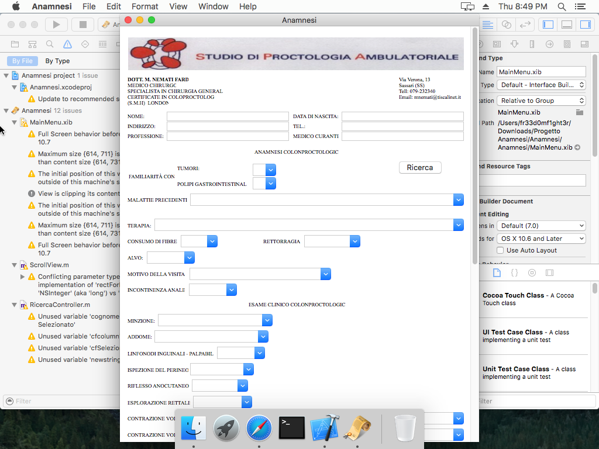
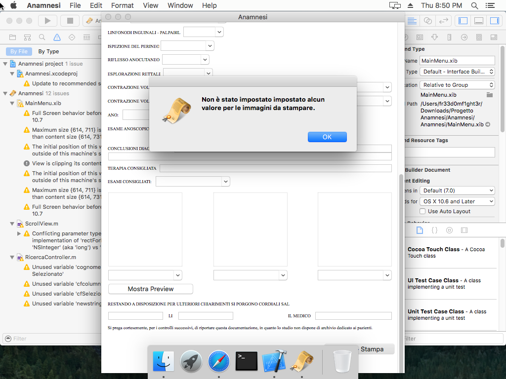
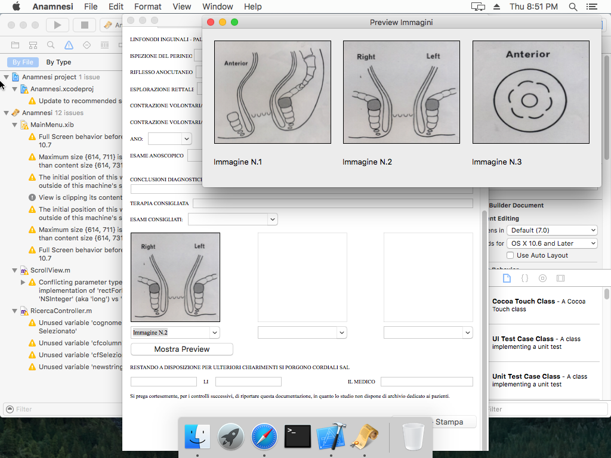
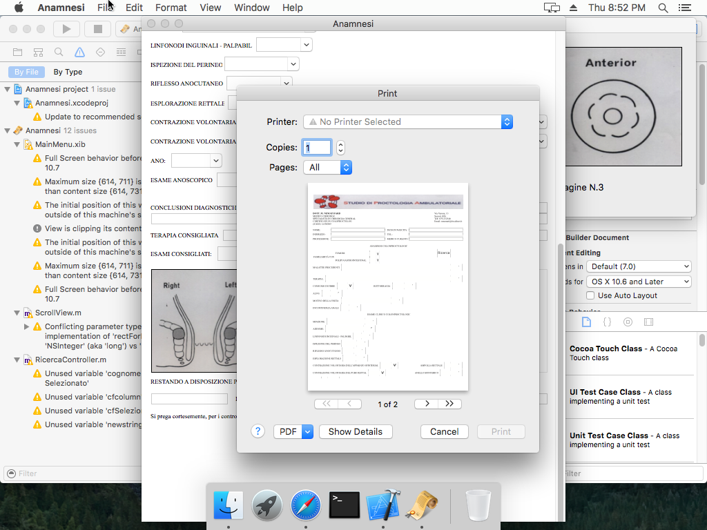

# Anamnesi
Applicazione per Mac OS X realizzata per lo studio di Studio di Proctologia Ambulatoriale Via Verona 13, 07100 Sassari (Italia).

L'applicativo permette di creare il foglio di Anamnesi e di Esame Clinico, salvarlo in PDF e stamparlo.
Inoltre permette di salvare i dati di ciascun paziente in modo da poterli aprire succesivamente con l'applicativo e modificarli.

Di segiuto alcune screenshot relative all'utilizzo dell'applicazione:

   

--

Rambod Rahmani <<rambodrahmani@autistici.org>>
